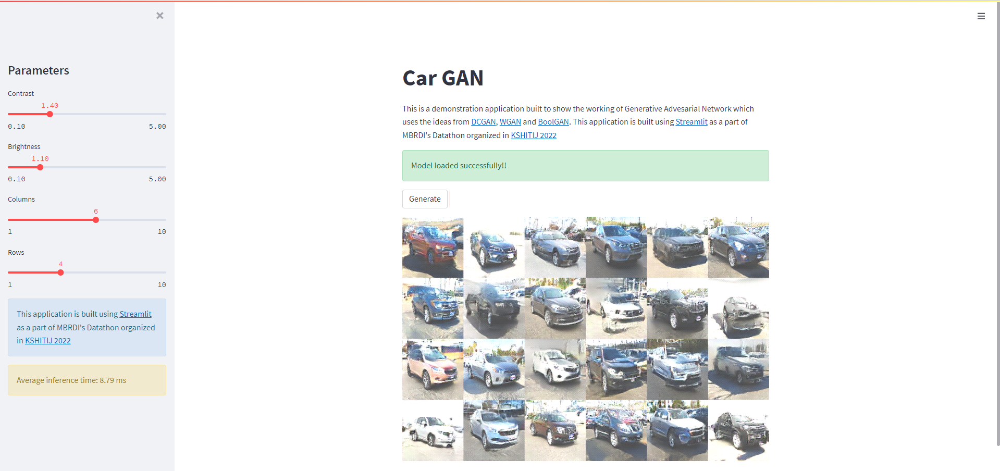

# Car-GAN
Application for Generative Adversarial Network based car prototyping mode built for MBRDI Datathon, KSHITJ-2022

# Getting Started

```shell
$ git clone https://github.com/debajyotidasgupta/Car-GAN.git

$ pip install -r requirements.txt

$ streamlit run app.py
```

# Screenshot


